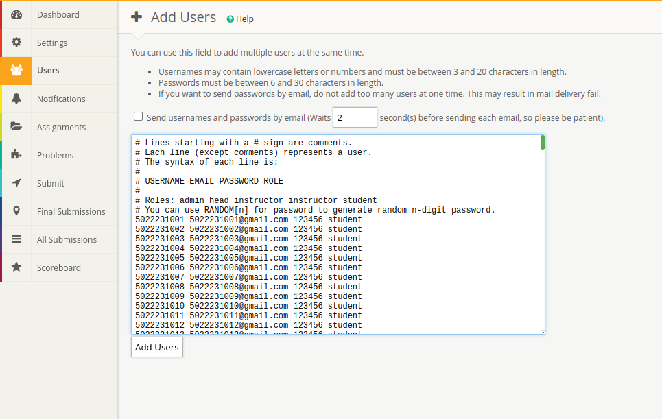
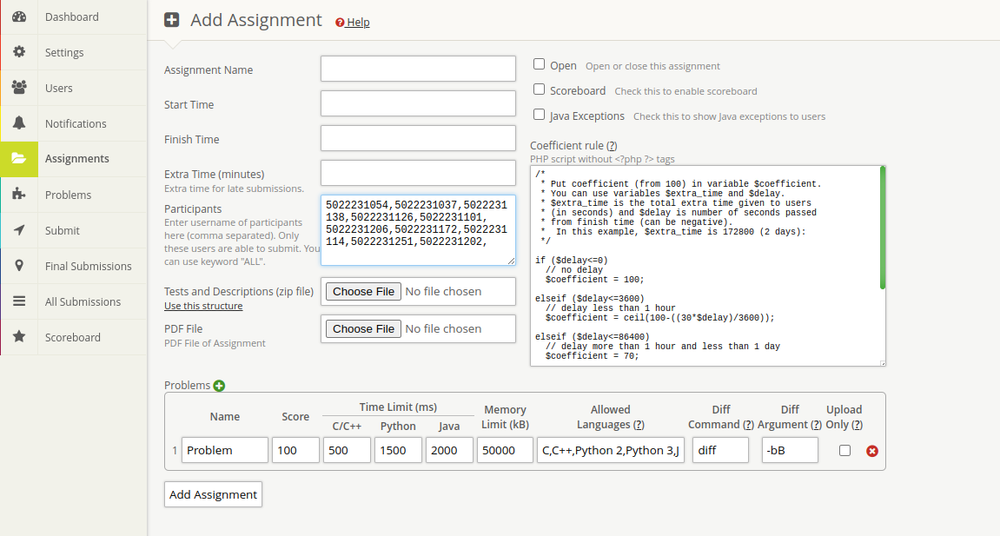

# Online Judge
## How to install:
1. Clone this repo
2. Change database info
3. Run ```docker compose up```
4. Open ```localhost:80``` if you're at local server. Or open the exposed IP in your server
5. Follow the installation process.
6. After the installation complete, go to Settings, and change ```tester data``` and ```assignment``` location to   ```/data/tester/``` and ```/data/assignments/```
7. Disable Sandboxing. It's enabled by the Docker Image but you will need some extra setup to use it, so disable it for now
8. [optional] Open ```/var/www/html``` and edit the website look. Change the image at ```assets/images``` to your choices. 

## How to manage:

Check if any container has started, with:

```
docker ps
```

If you need to stop this container, use 

```
docker compose stop
```

Start with:

```
docker compose up
```

## More Documentation

Visit https://github.com/mjnaderi/Sharif-Judge.git  for more info about the online judge

## What to do after installation?

### Add User
Read this about adding user: https://github.com/mjnaderi/Sharif-Judge/blob/docs/v1.4/users.md. Adding users manually by NRP might seem like a lot of work, but don't worry! We have a Bash script prepared for this scenario.

- First, take a look at the ```createuser.sh``` script and customize the output file format. You can specify the ```nrp_start``` and ```nrp_end``` values, as well as set the email and password to match your requirements.
- After that, run the shell script with 
    ```
    bash createuser.sh
    ```
    A file will be created for you. Copy all the entry with ```ctrl+A```
- Open the add user tab in the website, and simply paste it



### Add Assignment
For a complete tutorial on this, please refer to https://github.com/mjnaderi/Sharif-Judge/blob/docs/v1.4/add_assignment.md. Now that we are on the same page, we understand that we need to specify who can access which assignment. To achieve this, we need to prepare all the user IDs based on the schedule. No need to worry, we have a Bash script for that.
- First, take a look at the ```assets/data/daftar-kelompok.txt``` script. You need to fill it with this format:
    ```
    NRP Group
    ``` 
    You can choose your own way to do this step.
- Afterward, review the ```get-participant.sh```script and customize it to suit your needs. Modify the ```desired_group```as required and change the ```output_file``` to your preference.
- After that, run the shell script with 
    ```
    bash get-participant.sh
    ```
    A file will be created for you. Copy all the entry with ```ctrl+A```
- Paste it at participant field when you create an assignment


Now you can schedule which group can participate on each session.